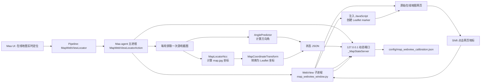

# 在线地图实时定位 README

本文档说明 MaaNTE 在线地图实时定位功能的完整实现。内容包括任务入口、运行时进程结构、NCC 定位算法、网页坐标标定、方向角预测、Leaflet 注入、HTTP 状态协议、配置参数、验证方法和故障排查。

目标读者：

- 需要使用在线地图实时定位功能的用户。
- 需要修改定位精度、方向识别或网页显示逻辑的开发者。
- 需要排查“没有显示指针”“标定不合格”“移动方向漂移”等问题的维护者。

## 1. 功能目标

任务 `在线地图实时定位` 会打开原始在线地图网站：

```text
https://www.ghzs666.com/yh-map#/
```

程序持续获取游戏截图，并完成两项实时计算：

1. 使用 `map_locator_ncc.py` 判断角色在本地大地图 `map.jpg` 中的位置。
2. 使用 `predict_angle.py` 判断游戏小地图指针的朝向。

完成坐标标定后，本地地图坐标会转换为网页 Leaflet 坐标。程序直接在原始网页的 Leaflet 地图图层中添加一个方向指针，不是在网页右上角额外叠加一张小地图。拖动、缩放网页地图时，方向指针会随 Leaflet 图层一起移动。

关闭 WebView 窗口即可结束任务。

## 2. 文件清单

核心实现文件：

| 文件 | 职责 |
| --- | --- |
| `agent/custom/action/map_webview_locator.py` | 主 custom action。负责截图循环、NCC 定位、方向预测、坐标转换、本地 HTTP 状态服务和 WebView 子进程生命周期。 |
| `agent/custom/action/map_webview_window.py` | WebView 子进程。负责打开在线地图、轮询状态、注入 JavaScript、创建 Leaflet marker、旋转指针和回传标定点。 |
| `agent/custom/action/map_locator_ncc.py` | 基于 NCC 模板匹配的本地地图定位器。输入游戏截图，输出 `map.jpg` 像素坐标。 |
| `agent/custom/action/predict_angle.py` | 基于 ONNX 模型的方向角预测器。输入游戏截图，输出角度和置信度。 |
| `agent/custom/action/map_webview_pointer.png` | 显示在网页地图上的指针图片。绿色背景像素已转换为透明像素。 |
| `agent/custom/action/__init__.py` | 导入并注册 custom action。 |
| `assets/resource/base/pipeline/MapLocator.json` | Maa pipeline 入口和默认参数。 |
| `assets/interface.json` | Maa UI 中的任务入口。 |
| `requirements.txt` | Python 依赖，包含 `pywebview`。 |

运行时资源：

| 文件 | 职责 |
| --- | --- |
| `assets/resource/base/image/map/map.jpg` | 本地完整地图。NCC 定位器会在其中搜索游戏小地图对应区域。 |
| `assets/resource/base/model/navi/pointer_model.onnx` | 方向角预测模型。 |
| `config/map_webview_calibration.json` | 用户实际标定结果。运行过程中自动创建和更新。 |

`config/` 和部分大体积资源目录已在 `.gitignore` 中忽略。标定文件属于本机运行数据，不应直接作为通用标定提交。

## 3. 入口注册

### 3.1 Maa UI 入口

`assets/interface.json` 中注册了 UI 任务：

```json
{
  "name": "MapWebViewLocator",
  "label": "在线地图实时定位",
  "entry": "MapWebViewLocator",
  "group": [
    "RealTimeAssist"
  ]
}
```

### 3.2 Pipeline 入口

`assets/resource/base/pipeline/MapLocator.json` 中定义了 pipeline：

```json
{
  "MapWebViewLocator": {
    "action": "Custom",
    "custom_action": "map_webview_locator",
    "custom_action_param": {
      "map_url": "https://www.ghzs666.com/yh-map#/",
      "update_interval": 0.1,
      "angle_backend": "auto",
      "angle_threshold": 0.0,
      "crop_size": 1800
    }
  }
}
```

### 3.3 Python custom action 注册

`map_webview_locator.py` 使用装饰器注册实现：

```python
@AgentServer.custom_action("map_webview_locator")
class MapWebViewLocatorAction(CustomAction):
    ...
```

`agent/custom/action/__init__.py` 导入该模块后，Maa agent 才能找到这个 custom action。

## 4. 总体架构

运行时包含一个 Maa agent 主进程、一个本地 HTTP 服务线程和一个 WebView 子进程。



设计要点：

- 游戏截图只抓取一次，然后同时传给位置定位和方向预测，避免同一轮使用不同时间点的画面。
- WebView 使用独立子进程运行，避免 GUI 事件循环阻塞 Maa agent。
- 本地 HTTP 服务只监听 `127.0.0.1` 和系统分配的动态端口。
- 网页显示使用 Leaflet 原生 marker，因此平移和缩放地图时不需要手工同步屏幕像素位置。

## 5. 主流程

`MapWebViewLocatorAction.run()` 是整个功能的主入口。

### 5.1 初始化阶段

程序依次执行：

1. 解析 `custom_action_param`。
2. 检查 Python 环境是否安装 `pywebview`。
3. 解析标定文件路径，默认值为 `config/map_webview_calibration.json`。
4. 加载已有标定点。
5. 初始化 `MapLocatorNcc`，加载本地大地图。
6. 初始化 `AnglePredictor`，加载 ONNX 模型和推理后端。
7. 根据标定点或手工参数生成坐标变换。
8. 启动 `_MapStateServer` 本地 HTTP 服务线程。
9. 启动 `map_webview_window.py` 子进程。

任何初始化异常都会记录日志，并让 custom action 返回失败。

### 5.2 实时循环

主循环条件：

```python
while not context.tasker.stopping and process.poll() is None:
```

只要 Maa 任务没有停止，并且 WebView 子进程仍然存活，就会持续执行：

```python
frame = controller.post_screencap().wait().get()
result = locator.locate(frame)
angle_result = predictor.predict(frame)
server.update_location(locator, result, angle_result)
```

每轮流程：

1. 从 Maa controller 获取一帧游戏截图。
2. 用 NCC 定位器计算本地地图坐标。
3. 用 ONNX 模型计算方向角。
4. 如果已经完成标定，将本地地图坐标转换为 Leaflet 坐标。
5. 将位置、方向、置信度和标定质量写入本地状态 JSON。
6. 按照 `update_interval` 控制循环频率。

### 5.3 退出与清理

以下任一情况会结束循环：

- 用户停止 Maa 任务。
- 用户关闭 WebView 窗口。
- WebView 子进程异常退出。
- 主循环发生异常。

`finally` 中始终执行：

1. 终止仍在运行的 WebView 子进程。
2. 关闭本地 HTTP 服务。
3. 等待 HTTP 服务线程结束。

## 6. NCC 本地地图定位

`MapLocatorNcc` 的职责是将游戏截图中的小地图与完整地图 `map.jpg` 对齐，输出角色所在的本地地图像素坐标。

### 6.1 核心常量

```python
MAP_SIZE = (16896, 18176)
MINI_MAP_ROI = (28, 20, 150, 150)
MAP_CROP_SIZE = 751
MINI_GRAY_RANGE = (24, 58)
BIG_GRAY_RANGE = (18, 77)
SEARCH_RADIUS = 520
GLOBAL_MIN_SCORE = 0.52
LOCAL_MIN_SCORE = 0.46
SMOOTHING_ALPHA = 0.3
MIN_FILTER_PIXELS = 120
CIRCLE_PADDING = 15
CENTER_RADIUS = 11
```

含义：

| 常量 | 含义 |
| --- | --- |
| `MAP_SIZE` | 预期本地大地图尺寸。实际尺寸不同会记录警告。 |
| `MINI_MAP_ROI` | 游戏截图中小地图区域，格式为 `[x, y, width, height]`。 |
| `MAP_CROP_SIZE` | 本地地图中与小地图视野对应的基准裁剪尺寸。 |
| `MINI_GRAY_RANGE` | 游戏小地图二值化时保留的灰度范围。 |
| `BIG_GRAY_RANGE` | 本地大地图二值化时保留的灰度范围。 |
| `SEARCH_RADIUS` | 已有上一帧位置时，局部搜索半径，单位为原始 `map.jpg` 像素。 |
| `GLOBAL_MIN_SCORE` | 全局搜索最低 NCC 分数。 |
| `LOCAL_MIN_SCORE` | 局部搜索最低 NCC 分数。 |
| `SMOOTHING_ALPHA` | 坐标指数平滑系数。值越小越稳定，但延迟越高。 |
| `MIN_FILTER_PIXELS` | 小地图模板中至少需要存在的有效二值像素数。 |
| `CIRCLE_PADDING` | 小地图圆形有效区向内收缩的边距。 |
| `CENTER_RADIUS` | 小地图中心排除半径，用于去除角色指针对匹配的干扰。 |

### 6.2 初始化大地图

初始化时会：

1. 使用灰度模式读取 `map.jpg`。
2. 检查地图尺寸。
3. 根据小地图显示比例缩小完整地图。
4. 对缩小后的地图做灰度区间二值化。

缩放比例：

```text
scale = MINI_MAP_ROI.width / MAP_CROP_SIZE
      = 150 / 751
      ≈ 0.1997
```

缩小后再做模板匹配可以显著降低计算量。

### 6.3 构造小地图模板

每一帧会从游戏截图裁剪：

```text
x = 28
y = 20
width = 150
height = 150
```

然后：

1. 转换为灰度图。
2. 使用 `MINI_GRAY_RANGE` 二值化。
3. 创建圆形 mask，只保留小地图圆形主体。
4. 将中心半径 `CENTER_RADIUS` 内的区域清空。
5. 检查模板中有效像素是否达到 `MIN_FILTER_PIXELS`。

清空中心区域很重要。游戏中的角色箭头会旋转，如果不排除中心箭头，方向变化会直接影响地图模板匹配。

### 6.4 全局搜索与局部搜索

首次定位或上一帧定位失败时：

- 在完整的缩小版大地图中执行全局搜索。
- 使用阈值 `GLOBAL_MIN_SCORE = 0.52`。
- 返回模式 `global`。

上一帧定位成功时：

- 只在上一帧位置附近搜索。
- 使用原始地图半径 `SEARCH_RADIUS = 520`。
- 使用阈值 `LOCAL_MIN_SCORE = 0.46`。
- 返回模式 `local`。

局部搜索速度更快，并且更不容易跳到远处的相似地形。

### 6.5 NCC 匹配与坐标恢复

模板匹配使用：

```python
cv2.matchTemplate(
    search_image,
    template,
    cv2.TM_CCORR_NORMED,
    mask=template_mask,
)
```

程序会清理 `NaN`、无穷值和超出合法范围的异常分数，然后取最高分位置。

最高分达到当前模式阈值后，恢复原始 `map.jpg` 坐标：

```text
raw_x = (match_x + template_width / 2) / scale
raw_y = (match_y + template_height / 2) / scale
```

输出坐标代表当前小地图中心在 `map.jpg` 中的位置。

### 6.6 坐标平滑

NCC 原始输出可能存在轻微跳动。程序对坐标做指数平滑：

```text
smoothed = previous_smoothed * (1 - alpha) + raw * alpha
alpha = 0.3
```

返回结构中同时保留：

| 字段 | 含义 |
| --- | --- |
| `raw_point` | 当前帧 NCC 直接输出的位置。 |
| `point` | 经过平滑后用于网页显示和标定的位置。 |

如果当前帧定位失败，程序会清空上一帧位置和平滑状态。下一次成功定位会重新执行全局搜索。

## 7. 坐标标定与变换

NCC 输出的是本地 `map.jpg` 像素坐标，网页需要 Leaflet 坐标。两套坐标不能直接混用，必须通过标定建立映射。

### 7.1 两套坐标

每个标定点包含：

```json
{
  "local": [14034.0, 9768.0],
  "online": [7.984375, 59.09375]
}
```

字段含义：

| 字段 | 含义 |
| --- | --- |
| `local` | `MapLocatorNcc` 输出的 `[map_x, map_y]`。 |
| `online` | 在线地图 Leaflet 使用的 `[latitude, longitude]`。 |

注意：Leaflet 使用 `[latitude, longitude]` 顺序，不是常见 GIS 接口中的 `[longitude, latitude]`。

### 7.2 标定文件

默认标定文件：

```text
config/map_webview_calibration.json
```

格式：

```json
{
  "pairs": [
    {
      "local": [1234, 5678],
      "online": [12.34, 56.78]
    },
    {
      "local": [2345, 6789],
      "online": [23.45, 67.89]
    },
    {
      "local": [3456, 7890],
      "online": [34.56, 78.9]
    }
  ]
}
```

### 7.3 为什么使用相似变换

默认拟合使用二维相似变换，只允许：

- 统一缩放。
- 旋转。
- 平移。

公式：

```text
leaflet_latitude  = a * local_x + b * local_y + c
leaflet_longitude = -b * local_x + a * local_y + d
```

矩阵形式：

```text
[ latitude  ]   [  a   b ] [ local_x ]   [ c ]
[ longitude ] = [ -b   a ] [ local_y ] + [ d ]
```

相似变换不会把二维地图压扁、斜切或拉伸成不合理形状。对于同一张地图的坐标系转换，这比任意六参数仿射变换更稳定。

代码内部统一使用六参数存储：

```text
(a, b, c, d, e, f)

latitude  = a * x + b * y + c
longitude = d * x + e * y + f
```

自动拟合得到的相似变换满足：

```text
d = -b
e = a
```

### 7.4 稳健拟合

标定点可能因为点击偏差、定位抖动或地标对应错误而包含离群点。`MapCoordinateTransform.fit()` 使用类似 RANSAC 的稳健流程：

1. 至少需要三个标定点。
2. 枚举任意两个不同本地位置的标定点。
3. 用这两个点生成候选相似变换。
4. 将候选变换应用到所有标定点。
5. 计算每个点的二维残差。
6. 残差不超过 `MAX_INLIER_ERROR = 2.0` 的点视为有效点。
7. 候选变换至少需要三个有效点。
8. 优先选择有效点最多的候选。
9. 有效点数相同时，选择 RMSE 更低的候选。
10. 使用最终有效点重新拟合一次。
11. 再次计算 RMSE、相对 RMSE 和条件数。

质量阈值：

```python
MAX_TRANSFORM_CONDITION = 12.0
MAX_RELATIVE_RMSE = 0.18
MAX_INLIER_ERROR = 2.0
```

含义：

| 阈值 | 含义 |
| --- | --- |
| `MAX_INLIER_ERROR` | 单个标定点允许的最大 Leaflet 坐标残差。 |
| `MAX_RELATIVE_RMSE` | 总体误差相对于标定点分布范围的最大比例。 |
| `MAX_TRANSFORM_CONDITION` | 变换矩阵最大条件数，用于拒绝接近退化的变换。 |

状态栏中的：

```text
标定有效点=5/6 | rmse=0.235
```

表示总共记录了六个点，其中五个符合统一变换，一个点被识别为离群点。

### 7.5 自动保存和替换规则

网页每提交一个标定点，服务端都会自动写入标定文件。

如果新标定点与已有标定点的本地坐标距离不超过 `20` 个 `map.jpg` 像素，程序会替换旧点，而不是新增重复样本。

### 7.6 手工锁定变换

可以通过 `online_transform` 直接提供六个系数：

```json
{
  "online_transform": [a, b, c, d, e, f]
}
```

此时程序不会根据网页点击重新拟合变换，称为锁定模式。网页仍可以保存标定点，但这些点不会改变当前转换结果。

## 8. 网页中采集标定点

### 8.1 正常标定步骤

1. 在游戏中站到一个容易确认的地标。
2. 启动 `在线地图实时定位`。
3. 等待页面底部出现当前 `map.jpg` 坐标。
4. 在网页地图中找到同一个地标。
5. 按住 `Shift` 点击网页地图中的地标。
6. 页面会显示已采集的 JSON，并尝试复制到剪贴板。
7. 子进程会自动将标定点提交给本地 HTTP 服务。
8. 服务端会写入 `config/map_webview_calibration.json`。
9. 对多个地标重复以上步骤。

最少需要三个有效点。为了降低误差，建议采集六个以上点。

### 8.2 推荐采样方式

不要只沿一条直线采集样本。推荐：

1. 选择一个起点。
2. 沿道路向前移动一段距离，采集第二个点。
3. 转向另一条近似正交道路，移动后采集第三个点。
4. 在附近区域继续采集更多点。
5. 检查状态栏中的有效点数量和 RMSE。

只沿单一方向采样，会让旋转关系不稳定，也更难识别错误地标。

### 8.3 清空标定

按住 `Ctrl + Shift` 点击网页地图，可以清空旧标定。

服务端会：

1. 清空内存中的标定点。
2. 清空自动拟合得到的变换。
3. 将标定文件写为：

```json
{"pairs": []}
```

4. 隐藏网页 marker，直到重新完成标定。

手工 `online_transform` 锁定模式不会因为清空标定而丢失变换。

## 9. 方向角预测

`AnglePredictor` 使用 ONNX 模型识别游戏小地图中心附近的方向箭头。

### 9.1 模型和默认 ROI

默认模型：

```text
assets/resource/base/model/navi/pointer_model.onnx
```

默认截图区域：

```python
pointer_roi = [73, 60, 64, 64]
```

格式：

```text
[x, y, width, height]
```

该 ROI 与当前游戏窗口截图布局有关。如果游戏分辨率、缩放比例或 UI 布局改变，需要重新检查这个区域。

### 9.2 推理预处理

每一帧：

1. 如果输入为 BGRA，先转换为 BGR。
2. 按 `pointer_roi` 裁剪图片。
3. 将 BGR 转换为 RGB。
4. 将像素值归一化到 `[0, 1]`。
5. 将维度从 `HWC` 转换为 `CHW`。
6. 增加 batch 维度。
7. 调用 ONNX Runtime。

### 9.3 输出解析

模型输出多个候选。程序取置信度最高的候选：

```python
confidence = output[:, 4]
best_idx = int(np.argmax(confidence))
```

候选中包含三个关键点：

| 关键点 | 含义 |
| --- | --- |
| `tip` | 箭头尖端。 |
| `left` | 箭头尾部左侧。 |
| `right` | 箭头尾部右侧。 |

先计算尾部中心：

```text
tail_center = (left + right) / 2
```

再计算尖端相对尾部中心的向量：

```text
dx = tip.x - tail_center.x
dy = tip.y - tail_center.y
```

角度公式：

```text
angle = degrees(atan2(dx, -dy)) mod 360
```

角度定义：

| 朝向 | 角度 |
| --- | --- |
| 上 | `0°` |
| 右 | `90°` |
| 下 | `180°` |
| 左 | `270°` |

角度按顺时针方向增加，与网页图片使用 CSS `rotate()` 的方向一致。

### 9.4 ONNX 推理后端

支持：

| 参数值 | 推理后端 |
| --- | --- |
| `auto` | 如果存在 DirectML 则使用 DirectML，否则使用 CPU。 |
| `directml` 或 `dml` | 使用 `DmlExecutionProvider`。 |
| `cpu` | 使用 `CPUExecutionProvider`。 |

如果请求的后端不可用，程序会回退到 CPU。

### 9.5 方向阈值

`angle_threshold` 用于过滤低置信度识别结果：

```json
{
  "angle_threshold": 0.0
}
```

当前默认值 `0.0` 会接受所有大于零的结果，适合先观察模型表现。如果指针方向频繁抖动，应根据实际状态栏中的 `conf` 调高阈值。

当某一帧方向识别失败时：

- 位置 marker 仍然会继续更新。
- 网页不会把指针重置到错误角度。
- 网页保留上一次有效旋转角度。

## 10. 网页指针图片

网页 marker 使用：

```text
agent/custom/action/map_webview_pointer.png
```

该资源由用户提供的 `pointer.png` 素材生成。

处理规则：

- 原图尺寸为 `19 x 22`。
- 精确匹配绿色 `(0, 255, 0)`。
- 将绿色背景像素的 alpha 改为 `0`。
- 共转换 `199` 个透明像素。
- 不修改指针本体中的其他像素。

网页中显示尺寸为：

```text
30 x 35
```

CSS 使用：

```css
image-rendering: pixelated;
transform-origin: 50% 50%;
transition: transform .1s linear;
```

因此放大后仍保持像素风格，并且旋转中心位于图片中心。

## 11. 本地 HTTP 状态服务

`_MapStateServer` 继承自 `ThreadingHTTPServer`。

监听地址：

```text
127.0.0.1:<系统动态分配端口>
```

仅供本机 WebView 子进程通信。

### 11.1 GET `/state.json`

获取当前定位状态。

示例：

```json
{
  "point": [14034, 9768],
  "rawPoint": [14040, 9770],
  "onlinePoint": [7.91612, 59.39165],
  "score": 0.8,
  "mode": "local",
  "angle": 123.4,
  "angleConfidence": 0.987,
  "angleFound": true,
  "mapSize": [16896, 18176],
  "calibrated": true,
  "calibrationCount": 6,
  "calibrationIssue": null,
  "calibrationInliers": 5,
  "calibrationRmse": 0.235
}
```

字段说明：

| 字段 | 含义 |
| --- | --- |
| `point` | 平滑后的 `map.jpg` 坐标。网页显示和采集标定使用该字段。 |
| `rawPoint` | 当前帧 NCC 原始坐标。 |
| `onlinePoint` | 经过标定转换后的 Leaflet `[latitude, longitude]`。没有有效标定时为 `null`。 |
| `score` | NCC 模板匹配分数。 |
| `mode` | `init`、`global`、`local` 或 `rejected`。 |
| `angle` | 方向角，单位为度。识别失败时为 `null`。 |
| `angleConfidence` | 方向模型置信度。 |
| `angleFound` | 当前帧方向是否通过阈值。 |
| `mapSize` | 本地大地图尺寸。 |
| `calibrated` | 当前是否存在可用坐标变换。 |
| `calibrationCount` | 已保存标定点总数。 |
| `calibrationIssue` | 标定失败原因。 |
| `calibrationInliers` | 稳健拟合采用的有效标定点数量。 |
| `calibrationRmse` | 有效标定点 RMSE。 |

### 11.2 POST `/calibration.json`

添加或替换一个标定点。

请求：

```json
{
  "local": [14034, 9768],
  "online": [7.984375, 59.09375]
}
```

响应：

```json
{
  "calibrated": true,
  "calibrationCount": 6,
  "calibrationIssue": null,
  "calibrationInliers": 5,
  "calibrationRmse": 0.235
}
```

### 11.3 POST `/calibration/reset.json`

清空自动标定点。

请求体可以为空对象：

```json
{}
```

## 12. WebView 子进程

主进程通过 `_start_viewer()` 启动：

```text
python map_webview_window.py
  --url <在线地图地址>
  --state-url <本地状态接口>
  --title <窗口标题>
  --width <窗口宽度>
  --height <窗口高度>
```

可选参数：

```text
--pointer-path <自定义指针图片路径>
--debug
```

Windows 下使用 `CREATE_NO_WINDOW`，避免弹出额外控制台窗口。

### 12.1 指针图片注入

子进程读取 PNG，并编码为 data URL：

```text
data:image/png;base64,...
```

然后替换 JavaScript 中的占位符：

```text
__MAANTE_POINTER_DATA_URL__
```

这样网页 marker 不依赖外部文件协议，也不需要在线地图网站允许跨域读取本地图片。

### 12.2 状态轮询

`_poll_state()` 每 `0.1` 秒执行一次：

1. 请求 `/state.json`。
2. 将 JSON 注入 `window.__maanMapLocatorUpdate(payload)`。
3. 从网页中取出待提交的标定队列。
4. 将普通标定点提交到 `/calibration.json`。
5. 将 reset 操作提交到 `/calibration/reset.json`。

轮询异常会被忽略，下一轮继续尝试。需要排查网页脚本问题时，应启用 `webview_debug`。

## 13. Leaflet 注入逻辑

`map_webview_window.py` 中的 `_OVERLAY_SCRIPT` 会被注入原始在线地图网页。

### 13.1 查找 Leaflet 实例

网页没有向外暴露固定的地图变量，因此脚本使用两种方式寻找 Leaflet map。

第一种方式：扫描 Vue 实例。

1. 遍历网页 DOM 元素。
2. 收集存在 `element.__vue__` 的元素。
3. 从 Vue 对象开始广度优先搜索。
4. 最多检查 `6000` 个对象。
5. 找到具有 Leaflet 特征方法的对象。

Leaflet map 判定条件：

```javascript
value._container
typeof value.addLayer === 'function'
typeof value.mouseEventToLatLng === 'function'
typeof value.latLngToLayerPoint === 'function'
```

第二种方式：hook Leaflet 方法。

脚本会包装：

```text
invalidateSize
setView
panBy
flyTo
_move
_resetView
```

只要网页调用这些 Leaflet map 方法，就将当前实例记录到 `state.map`。

这种方式用于提高兼容性，但在线网站升级后仍可能需要调整。

### 13.2 创建 marker

完成标定且首次收到 `onlinePoint` 后，网页创建：

```javascript
window.L.marker([0, 0], {
  icon,
  interactive: false,
  zIndexOffset: 1000000,
}).addTo(state.map);
```

重要属性：

| 属性 | 含义 |
| --- | --- |
| `interactive: false` | 指针不会阻挡网页地图点击。 |
| `zIndexOffset: 1000000` | 指针尽量显示在其他地图图层上方。 |
| `iconAnchor: [15, 18]` | 指针锚点位于放大图片中心附近。 |

### 13.3 更新 marker

每次状态更新：

1. 没有 `point`：隐藏 marker，显示“暂未定位”。
2. 有本地 `point`，但没有 `onlinePoint`：隐藏 marker，提示继续标定或清空错误标定。
3. 有 `onlinePoint`：显示 marker，并执行：

```javascript
state.marker.setLatLng(payload.onlinePoint);
```

由于 marker 属于 Leaflet 图层，网页缩放和拖动后仍然保持正确位置。

### 13.4 旋转角度连续化

CSS 可以直接旋转图片，但 `359° -> 1°` 如果直接赋值，浏览器可能沿反方向旋转 `358°`。脚本会计算最短角度差：

```javascript
const delta = ((angle - state.displayAngle + 540) % 360) - 180;
state.displayAngle += delta;
```

示例：

```text
旧角度 = 359°
新角度 = 1°
delta = 2°
显示角度 = 361°
```

CSS 中 `361°` 与 `1°` 指向相同方向，但动画只旋转 `2°`。

## 14. 配置参数

`MapWebViewLocator` 支持以下参数：

| 参数 | 默认值 | 说明 |
| --- | --- | --- |
| `map_url` | `https://www.ghzs666.com/yh-map#/` | 在线地图地址。 |
| `update_interval` | `0.1` | 主循环最小间隔，单位为秒。最小值会限制为 `0.01`。 |
| `title` | `MaaNTE Online Map` | WebView 窗口标题。 |
| `width` | `1280` | WebView 窗口宽度。 |
| `height` | `820` | WebView 窗口高度。 |
| `webview_debug` | `false` | 是否启用 pywebview 调试模式。 |
| `pointer_image` | 内置 `map_webview_pointer.png` | 自定义网页指针图片路径。支持绝对路径或项目根目录相对路径。 |
| `calibration_path` | `config/map_webview_calibration.json` | 标定文件路径。支持绝对路径或项目根目录相对路径。设为空值可禁用加载和保存。 |
| `online_transform` | 无 | 手工锁定六参数变换 `[a, b, c, d, e, f]`。 |
| `big_map_path` | 内置 `map.jpg` | 自定义本地大地图路径。 |
| `map_path` | 无 | `big_map_path` 的兼容别名。 |
| `angle_backend` | 环境变量或 `cpu` | 方向模型后端。pipeline 默认传入 `auto`。 |
| `backend` | 无 | `angle_backend` 的兼容回退参数。 |
| `pointer_roi` | `[73, 60, 64, 64]` | 方向模型使用的截图区域。 |
| `angle_threshold` | `0.0` | 方向结果最低置信度。 |
| `crop_size` | `1800` | 当前实现未使用。属于遗留配置，修改它不会影响定位或网页显示。 |

完整配置示例：

```json
{
  "MapWebViewLocator": {
    "action": "Custom",
    "custom_action": "map_webview_locator",
    "custom_action_param": {
      "map_url": "https://www.ghzs666.com/yh-map#/",
      "update_interval": 0.1,
      "title": "MaaNTE Online Map",
      "width": 1280,
      "height": 820,
      "webview_debug": false,
      "calibration_path": "config/map_webview_calibration.json",
      "angle_backend": "auto",
      "angle_threshold": 0.0,
      "pointer_roi": [73, 60, 64, 64]
    }
  }
}
```

## 15. 状态栏说明

定位成功后，网页底部会显示类似：

```text
MaaNTE: map.jpg=(14034, 9768)
| Leaflet=(7.98438, 59.09375)
| 标定有效点=5/6
| rmse=0.235
| score=0.800
| angle=123.4° conf=0.987
```

含义：

| 文本 | 含义 |
| --- | --- |
| `map.jpg=(x, y)` | NCC 平滑后的本地地图坐标。 |
| `Leaflet=(lat, lng)` | 转换后的网页地图坐标。 |
| `标定有效点=5/6` | 六个标定点中有五个参与最终拟合。 |
| `rmse=0.235` | 标定有效点的均方根误差。 |
| `score=0.800` | NCC 匹配置信度。 |
| `angle=123.4°` | 当前方向。 |
| `conf=0.987` | 方向模型置信度。 |

## 16. 常见问题

### 16.1 网页没有显示指针

按顺序检查：

1. 页面底部是否显示 `map.jpg=(x, y)`。
2. 如果显示“暂未定位”，检查 NCC 是否能识别小地图。
3. 如果显示“标定点=0/3”或类似文本，继续采集至少三个有效点。
4. 如果显示“标定质量不合格”，按住 `Ctrl + Shift` 点击地图清空标定，再重新采集。
5. 如果有 Leaflet 坐标但仍没有 marker，在线地图网站结构可能已经变化。启用 `webview_debug` 检查注入脚本。

### 16.2 标定后判定不合格

常见原因：

- 点击的网页地标和游戏位置不是同一个地点。
- 只沿一条直线采样。
- NCC 当前帧发生跳点。
- 在角色仍然移动时点击网页，导致本地坐标与在线地标错位。
- 把 Leaflet 坐标误写成 `[longitude, latitude]`。

处理方式：

1. 清空旧标定。
2. 等角色停止移动。
3. 观察 `score` 是否稳定。
4. 选择容易识别的地标。
5. 沿两个不同方向采样。
6. 采集六个以上点。
7. 检查 `标定有效点` 和 `rmse`。

### 16.3 朝一个方向移动，但网页位置左右漂移

需要区分两类问题。

第一类：标定问题。

- 检查有效点数量和 RMSE。
- 确认不存在大量离群点。
- 在当前活动区域增加局部标定点。
- 如果地图边缘误差明显大于中心区域，可能存在非线性形变，需要升级为分区域映射。

第二类：NCC 抖动。

- 对比日志中的 `point` 和 `raw`。
- 如果 `raw` 持续左右跳动，而 `point` 只是较轻微抖动，说明误差来自 NCC。
- 可以降低 `SMOOTHING_ALPHA` 提高稳定性，但会增加延迟。
- 可以提高 NCC 分数阈值减少误匹配，但可能增加定位失败。

### 16.4 指针方向抖动

检查：

- 状态栏中的 `conf` 是否很低。
- `pointer_roi` 是否仍然覆盖游戏指针。
- 游戏 UI 缩放和窗口分辨率是否发生变化。

处理方式：

- 调高 `angle_threshold`。
- 调整 `pointer_roi`。
- 如需更平滑的视觉效果，可在 JavaScript 中增加角度低通滤波。目前只处理跨越 `0°` 的最短旋转路径，没有额外做角度平滑。

### 16.5 WebView 无法启动

检查 Python 环境是否安装：

```powershell
pip install -r requirements.txt
```

核心依赖：

```text
pywebview>=5.0,<7.0
```

### 16.6 网页一直显示“正在查找网页 Leaflet 地图”

说明 JavaScript 没有找到 Leaflet map 实例。

可能原因：

- 在线地图网站升级。
- Leaflet 加载失败。
- 网页网络请求失败。
- Vue 内部结构变化。

处理方式：

1. 将 `webview_debug` 设置为 `true`。
2. 检查网页控制台。
3. 确认 `window.L` 是否存在。
4. 检查 Leaflet map 是否仍可从 Vue 实例或方法 hook 中获取。

### 16.7 配置路径在哪里

默认路径：

```text
<项目根目录>/config/map_webview_calibration.json
```

这是运行时文件，已被 `.gitignore` 忽略。

## 17. 已知限制

1. NCC 使用固定小地图 ROI。游戏窗口分辨率或 UI 布局变化后，需要修改 `MINI_MAP_ROI`。
2. 方向模型使用固定 `pointer_roi`。游戏窗口分辨率或 UI 布局变化后，需要调整参数。
3. 坐标转换默认是全局相似变换。如果网页底图与本地 `map.jpg` 存在非线性形变，单一变换无法完全消除误差。
4. Leaflet 实例发现依赖当前在线地图网页结构。网站升级后可能需要调整注入脚本。
5. WebView 子进程的轮询异常会被吞掉并在下一轮重试。开发调试时应启用 `webview_debug`。
6. `crop_size` 当前未使用。
7. 当前只对位置做指数平滑。方向角只做跨越 `0°` 时的最短路径连续化，没有做模型输出低通滤波。
8. `angle_threshold = 0.0` 比较宽松。正式使用时应根据实际置信度分布调优。

## 18. 修改建议

### 18.1 调整 NCC 定位

修改：

```text
agent/custom/action/map_locator_ncc.py
```

重点参数：

```text
MINI_MAP_ROI
SEARCH_RADIUS
GLOBAL_MIN_SCORE
LOCAL_MIN_SCORE
SMOOTHING_ALPHA
MINI_GRAY_RANGE
BIG_GRAY_RANGE
```

### 18.2 调整坐标标定

修改：

```text
agent/custom/action/map_webview_locator.py
```

重点参数：

```text
MAX_TRANSFORM_CONDITION
MAX_RELATIVE_RMSE
MAX_INLIER_ERROR
```

### 18.3 调整方向识别

优先修改 pipeline 参数：

```json
{
  "pointer_roi": [73, 60, 64, 64],
  "angle_threshold": 0.0,
  "angle_backend": "auto"
}
```

模型解析逻辑位于：

```text
agent/custom/action/predict_angle.py
```

### 18.4 调整网页显示

修改：

```text
agent/custom/action/map_webview_window.py
```

重点位置：

- `.maan-player-marker`：指针尺寸。
- `iconAnchor`：Leaflet marker 锚点。
- `updateMarkerAngle()`：角度连续化。
- `ensureMap()`：Leaflet 实例发现。
- `window.__maanMapLocatorUpdate()`：状态渲染。

## 19. 验证方法

### 19.1 Python 语法检查

```powershell
.\.venv\Scripts\python.exe -m py_compile `
  agent\custom\action\map_webview_locator.py `
  agent\custom\action\map_webview_window.py `
  agent\custom\action\map_locator_ncc.py `
  agent\custom\action\predict_angle.py `
  agent\custom\action\__init__.py
```

### 19.2 JavaScript 语法检查

```powershell
.\.venv\Scripts\python.exe -c "import sys; sys.path.insert(0, 'agent/custom/action'); import map_webview_window as m; print(m._overlay_script(m._pointer_data_url(m._resolve_pointer_path(None))))" | node --check
```

### 19.3 Git diff 格式检查

```powershell
git diff --check
```

### 19.4 指针透明像素检查

```powershell
.\.venv\Scripts\python.exe -c "from PIL import Image; from collections import Counter; im=Image.open(r'agent\custom\action\map_webview_pointer.png').convert('RGBA'); c=Counter(im.getdata()); print('transparent=', sum(n for (*_, a), n in c.items() if a == 0), 'opaque_green=', c[(0, 255, 0, 255)])"
```

预期结果：

```text
transparent= 199 opaque_green= 0
```

## 20. 后续可演进方向

当前实现适合单一区域、固定 UI 布局下的实时导航显示。进一步演进可以考虑：

1. 分区域坐标映射：根据本地地图区域选择不同相似变换，降低非线性误差。
2. 轨迹记录：保存 `rawPoint`、`point`、`onlinePoint`、`score` 和 `angle`，便于量化漂移。
3. 角度滤波：对方向角做圆周低通滤波，降低低置信度抖动。
4. 自动 ROI 标定：根据游戏窗口尺寸缩放 `MINI_MAP_ROI` 和 `pointer_roi`。
5. 更明确的 WebView 错误反馈：将当前被忽略的轮询异常显示到状态栏或写入日志。
6. Leaflet 兼容层：将网站特定的实例发现逻辑单独封装，降低在线地图升级后的维护成本。
